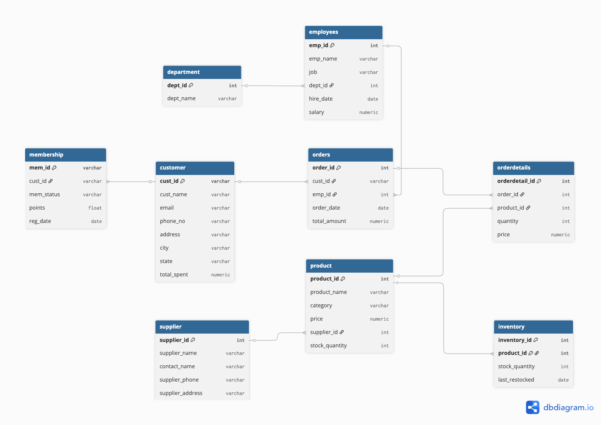

# 🎮 Tungsten Gaming Store – Retail Database System

A production-style PostgreSQL database designed for a gaming retail store to manage customers, products, orders, and inventory.

This project demonstrates **data modeling, schema design, constraints, indexing, and containerized deployment** — similar to real-world backend and data engineering systems.

---

## 🚀 Tech Stack

- PostgreSQL 16
- Docker & Docker Compose
- SQL (DDL, DML, Constraints, Indexing)
- DBeaver
- dbdiagram.io (ERD design)

---

## 📐 Architecture

### Entity Relationship Diagram

---

## 🗄️ Database Design Highlights

### ✅ Schema Design
- Normalized to **3NF**
- Separate tables for customers, products, orders, order_details, inventory
- Surrogate primary keys (SERIAL)

### ✅ Data Integrity
- NOT NULL constraints
- UNIQUE email enforcement
- Foreign key relationships
- CHECK constraints (price > 0, quantity ≥ 0)

### ✅ Performance
- Indexes on foreign keys and join columns
- Optimized for faster queries and analytics

### ✅ Deployment
- Dockerized PostgreSQL instance
- Auto-loads schema + seed data on startup

---

## ⚡ Quick Start (Run Locally)

### 1. Clone repo
git clone https://github.com/Anusha3997/Tungsten-Gaming-Store.git
cd Tungsten-Gaming-Store

### 2. Start database
docker-compose up

### 3. Connect via DBeaver
Host: localhost
Port: 5432
Database: tungsten
User: admin
Password: admin

## Author
Anusha Nagula

